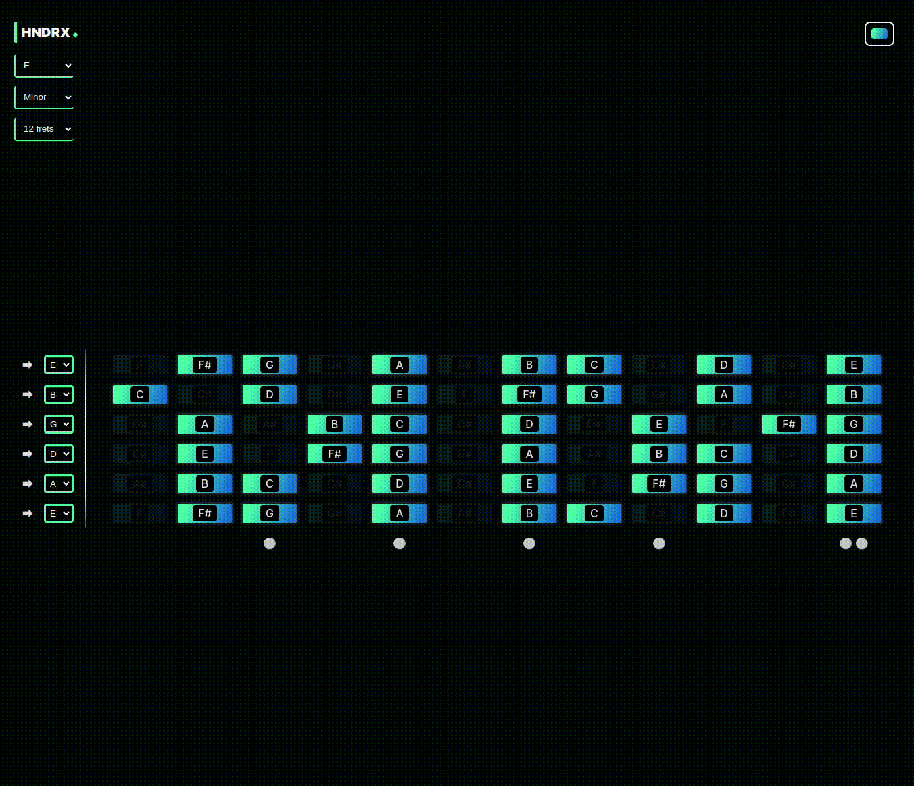

# Hendrix

Hendrix is a website designed to visually assist with music composition on the guitar. Choose a root note and scale, and the correct notes will be displayed on the fretboard.



Access the website here => https://hendrix-lnardon.vercel.app/

</br>

## How to use

### Using Docker Image (Docker Hub)

1 - Pull the latest image from Docker Hub:

```bash
docker pull lnardon/hendrix
```

2 - Run the container.

```bash
docker run -d -p 1969:1969 lnardon/hendrix
```

3 - Go to http://localhost:1969

</br>
</br>

### Build from source

1 - Clone the repository and build the Docker image:

```bash
git clone https://github.com/lnardon/Hendrix.git && cd Hendrix && docker build -t hendrix .
```

2 - Start the container using the following command. Replace the placeholders with your information:

```bash
docker run -d -p 1969:1969 hendrix
```

3 - Go to http://localhost:1969
